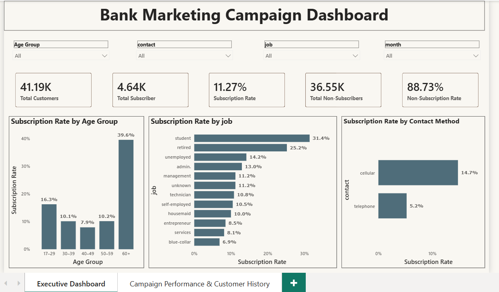

## Bank Marketing Campaign Analysis

A SQL and Power BI project analyzing a Portuguese bank's telemarketing campaigns to identify the customer characteristics, financial profile, campaign strategies, and macroeconomic conditions associated with higher term deposit subscription rates.

## Dashboard
<p align="center">
  
  
</p>

## Interactive Dashboard

🔗 **View Interactive Dashboard (Power BI Service)**  
[Open Dashboard](https://app.powerbi.com/links/NVe49A3P-m?ctid=b5b5d8fb-3a53-425c-924d-8eaff50e1945&pbi_source=linkShare)

📥 **Download Power BI File**  
[Bank Marketing Dashboard.pbix](powerbi/Bank%20Marketing%20Dashboard.pbix)
## Business Problem

Despite contacting more than 41,000 customers, the bank achieved a relatively low subscription rate for its term deposit campaign. Understanding which customer segments and campaign practices drive successful subscriptions is essential for improving future telemarketing performance.

## Business Objective

Identify the customer characteristics, financial profile, campaign practices, and macroeconomic conditions most strongly associated with successful term deposit subscriptions, and translate these findings into actionable recommendations for improving future telemarketing campaigns.

## Business Question

Which customer characteristics, financial profile attributes, campaign strategies, and economic conditions are associated with higher subscription rates, and how can these insights improve the effectiveness of future telemarketing campaigns?

## Dataset
| Attribute       |                            Value |
| --------------- | -------------------------------: |
| Source          |  UCI Machine Learning Repository |
| Dataset         | Bank Marketing (Additional Full) |
| Records         |                           41,188 |
| Variables       |                               21 |
| Target Variable |        Term Deposit Subscription |
| URL             |(https://archive.ics.uci.edu/dataset/222/bank+marketing
)|

https://archive.ics.uci.edu/dataset/222/bank+marketing

## Tools & Technologies
Category	Tool
Database	SQL Server
Query Language	SQL (T-SQL)
Data Cleaning	SQL
Exploratory Data Analysis	SQL
Data Visualization	Power BI
Version Control	Git & GitHub
Documentation	Microsoft Word

## Project Workflow
```text
Raw Dataset
      ↓
Data Cleaning (SQL)
      ↓
Exploratory Data Analysis (SQL)
      ↓
Business Insights
      ↓
Power BI Dashboard
      ↓
Business Recommendations
```

## Data Cleaning

Data preparation was performed entirely in SQL Server and included:

Data type validation and conversion
Duplicate verification
Missing value assessment
Category standardization
Feature preparation for analysis

📄 **SQL Script:**  
[01_Data_Cleaning.sql](sql/01_Data_Cleaning.sql)

## Exploratory Data Analysis

The exploratory data analysis was organized into six thematic SQL scripts:

| Analysis Area | SQL Script |
|--------------|------------|
| Campaign Performance | [02_Campaign_performance.sql](sql/02_Campaign_performance.sql) |
| Customer Segmentation | [03_Customer_segmentation.sql](sql/03_Customer_segmentation.sql) |
| Financial Profile | [04_Financial_status.sql](sql/04_Financial_status.sql) |
| Campaign Strategy | [05_Campaign_strategy.sql](sql/05_Campaign_strategy.sql) |
| Macroeconomic Indicators | [06_Macroeconomic_indicators.sql](sql/06_Macroeconomic_indicators.sql) |
| Multidimensional Analysis | [07_multidimensional_analysis.sql](sql/07_multidimensional_analysis.sql) |

## Project Results
Analysis Area	Key Finding
Campaign Performance	Overall subscription rate: 11.27%
Customer Segmentation	Customers aged 60+ achieved the highest subscription rate (39.56%)
Occupation	Retired customers and students were the strongest-performing customer groups
Financial Profile	Housing and personal loan status showed limited predictive value
Campaign Strategy	Cellular contacts (14.74%) significantly outperformed telephone (5.23%)
Campaign History	Previous campaign success achieved a 65.11% subscription rate
Macroeconomic Indicators	Lower Euribor rates were generally associated with higher subscription rates

## Business Recommendations
Recommendation	Expected Benefit
Prioritize retirees, older customers and students	Higher subscription rates
Make cellular the primary communication channel	Improved campaign performance
Focus on the first few customer contacts	Reduced marketing costs
Use previous campaign history for customer targeting	More accurate segmentation
Optimize campaign timing	Higher marketing efficiency
Monitor macroeconomic conditions during campaign planning	Better decision making
Executive Summary

A concise business report summarizing the project methodology, key findings, and recommendations is available here:

📄 reports/Executive Summary.pdf

## Repository Structure

```text
Bank-Marketing-Campaign-Analysis/
│
├── data/
│   ├── bank-additional-full.csv
│   └── bank_marketing_clean.csv
│
├── sql/
│   ├── 01_data_cleaning.sql
│   ├── 02_Campaign_performance.sql
│   ├── 03_Customer_segmentation.sql
│   ├── 04_Financial_status.sql
│   ├── 05_Campaign_strategy.sql
│   ├── 06_Macroeconomic_indicators.sql
│   └── 07_multidimensional_analysis.sql
│
├── powerbi/
│   └── Bank Marketing Dashboard.pbix
│   ├── dashboard_page_1.png
│   └── dashboard_page_2.png
│
├── reports/
│   └── Executive Summary.pdf
│
└── README.md
```
## Future Improvements
Develop predictive models to estimate customer subscription probability.
Compare the performance of classification algorithms such as Logistic Regression, Random Forest.
Build an interactive forecasting dashboard.

## Author

Farah Bensalem

## GitHub: 
https://github.com/FARAHBENSALEM01
## LinkedIn: 
https://www.linkedin.com/in/farah-bensalem/
